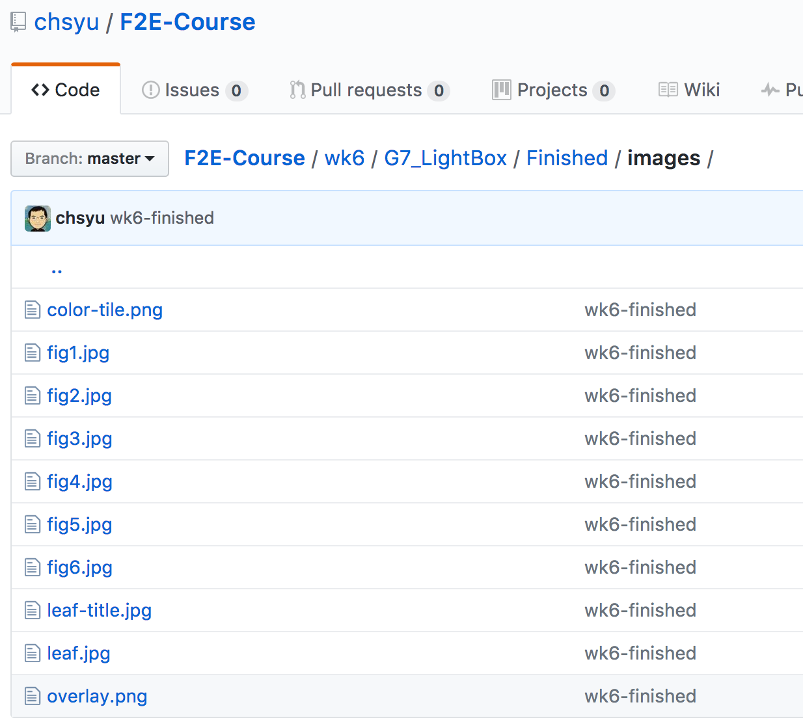
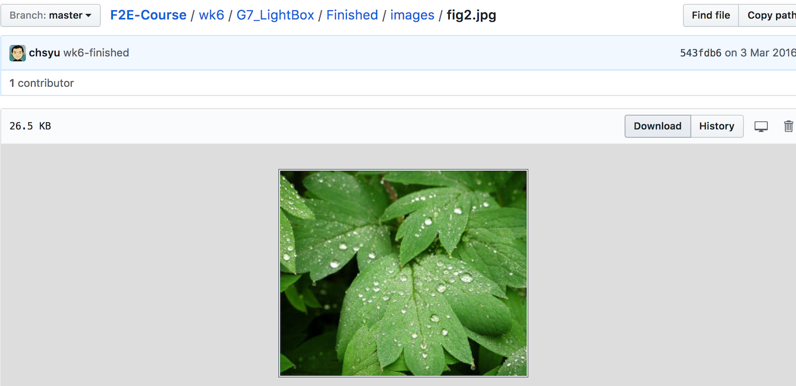
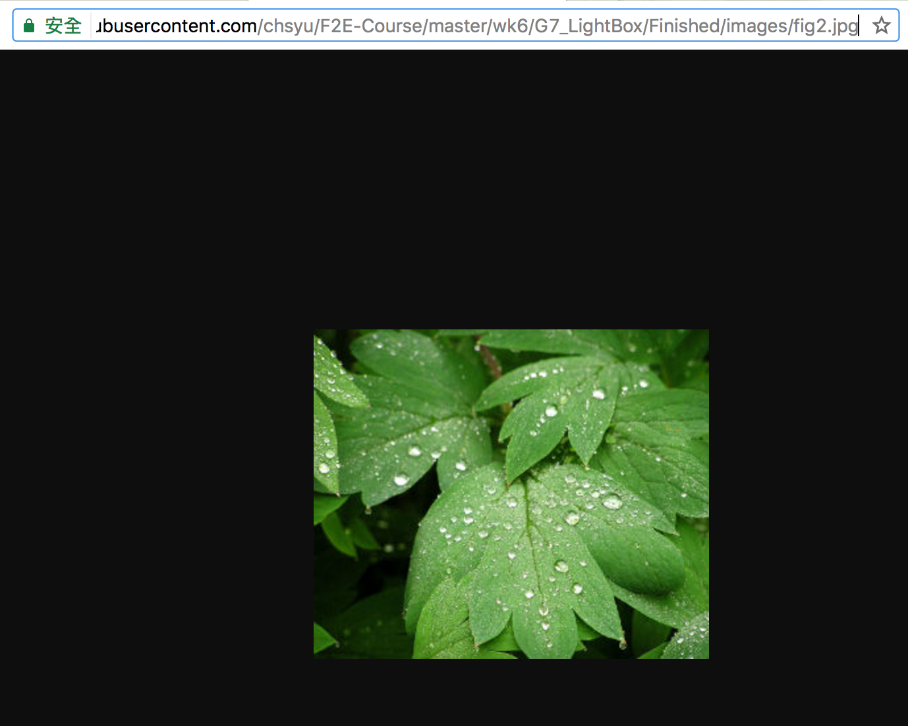

## 如何建立雲端圖片並取得URL(2017/3/25)

---

> 由於我們目前的Node伺服器還沒有處理圖片檔，CSS檔與JS檔(合稱為靜態檔案)的能力。本週的作業要建立一個靜態網站，若你的網頁需要圖片，你可以先將圖片上傳到GIT，再取得圖片儲存在GIT的URL，之後將你的網頁圖片的部分，用這些URL取代即可。

### 如何取得儲存在GIT圖片的URL

首先，當然要把圖片PUSH到一個GIT專案。之後後進入GIT專案的網頁點選圖片的目錄

點擊你取得URL的圖片，你會看到一個圖片的操作晝面

注意右側有一個download的按鈕，按下之後，會進入圖片真正的儲存畫面

這個時候，顯示在瀏覽器網址列的URL，就是你要的圖片URL
